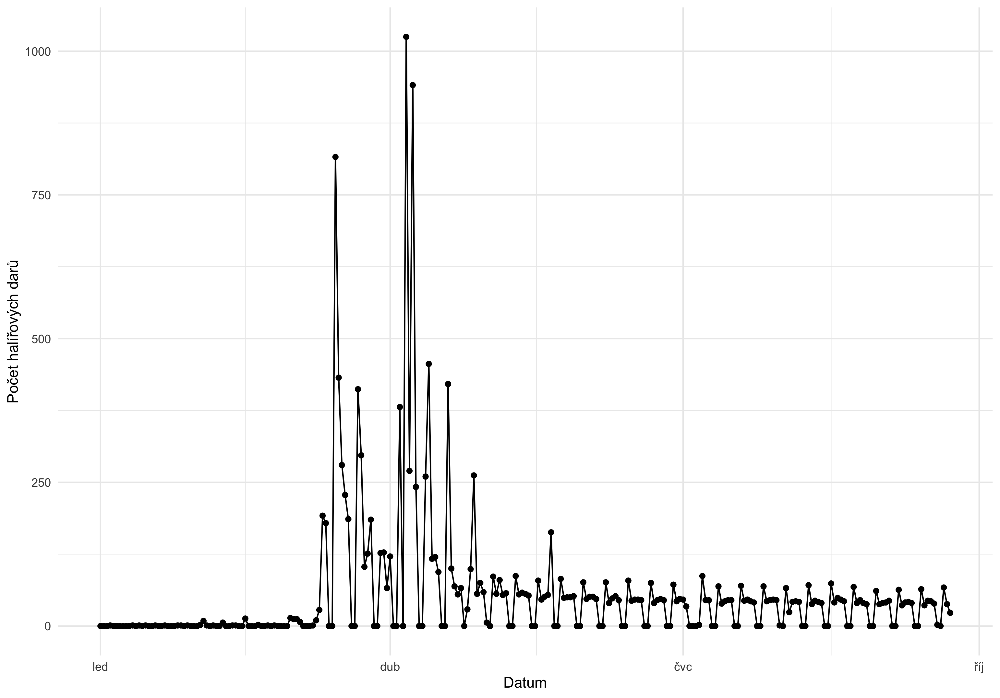
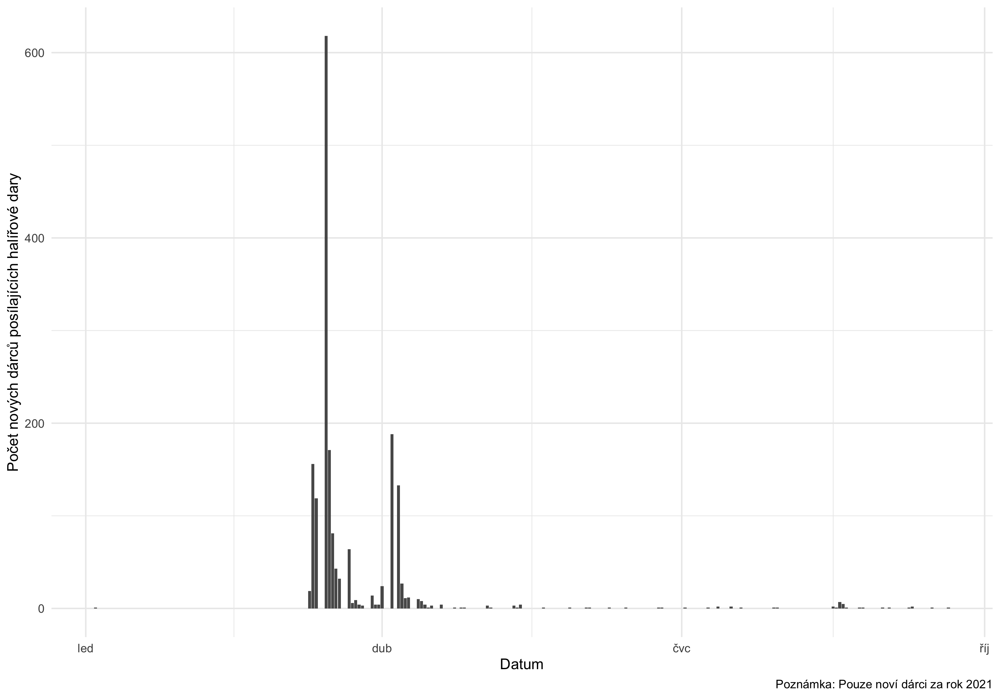

# README

Scripts for scraping transfers on ANO's transparent accounts. 
If there is no .csv file, the script scrapes as many transfers
from the account as possible (the number is limited by the website which allows
for 200 clicks on the 'Load more' button). 
If there is a .csv file with scraped data, the script appends new transfers to the file.  

## Usage
### Run scrapers

`node src/scraper-ano.js [account_number]`  

or 

`node src/scraper-ano-daily.js [account_number]`

e.g.

`node src/scraper-ano.js 4070217`

### Analyse the data

`Rscript 00_merge_data.R [account_number]`
`Rscript 01_clean_names.R`
`Rscript 02_analysis.R`

## Heller donations

